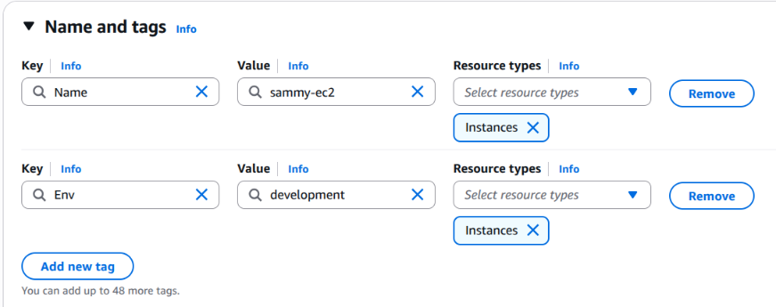

# Cloud Security with AWS IAM

**Project Link:** [View Project](http://nextwork.ai/projects/aws-security-iam)

**Author:** Sammy Shah Saleh  
**Email:** sammysaleh769@gmail.com

---

---

## Introducing Today's Project!

### Project overview

This project demonstrates how to use AWS IAM to manage permissions and access control settings within an AWS environment. I completed this project to build a strong foundational understanding of cloud security principles from the ground up.

### Tools and concepts

AWS Services Used: Amazon EC2 and AWS Identity and Access Management (IAM). Key Concepts Learned: IAM Users & Groups, EC2 Instance Tagging, and JSON Policy Structure.

### Project reflection

Time to Complete: Approximately 2 hours. The most challenging part was mastering JSON policies. Crafting the exact syntax to balance permissions took careful focus. Most rewarding part was verifying access controls. Seeing the explicit "Permission Denied" error when trying to edit tags proved that the security boundaries worked exactly as intended.

---

## Tags

### What I did in this step

In this step, I launched two Amazon EC2 instances to increase NextWork's computing power. This setup ensures the website can smoothly handle an expected increase in users and web traffic.

### Understanding tags

Tags allow us to label and organize our AWS resources effectively. They provide a structured way to group and manage infrastructure components

### My tag configuration

For this setup, I applied an Env (Environment) tag to the EC2 instances. The assigned values are Production and Development to clearly separate the two environment

---

## IAM Policies

### What I did in this step

In this step, I configured IAM policies to manage access control for a new NextWork intern. The objective was to grant the intern full access to the development environment while securely restricting them from the production environment.

### Understanding IAM policies

IAM policies are collections of permissions that define who can access specific AWS resources.

### The policy I set up

For this project, I utilized JSON-formatted policies to precisely control and restrict user access levels.

### Policy effect

I configured a custom IAM policy that grants full management permissions for any EC2 instance tagged as Development. Additionally, the policy allows the user to view information across all instances, while explicitly denying permissions to create or delete tags.

### Understanding Effect, Action, and Resource

{1} Effect: Specifies whether to grant (`Allow`) or block (`Deny`) permissions. A `Deny` statement always overrides an `Allow.` {2} Action: Defines the specific AWS tasks or API operations targeted. It uses a `service:action` format, and wildcards (*) can group multiple actions. {3} Resource: Identifies the specific AWS objects the policy applies to. These are listed via ARNs, where a wildcard (*) applies the action to all resources.

---

## My JSON Policy

---

## Account Alias

### What I did in this step

In this step, I created an AWS account alias to simplify the console login process. This custom nickname makes the sign-in URL easier to remember and use.

### Understanding account aliases

An account alias replaces the default 12-digit AWS Account ID in the sign-in portal URL with a custom, human-readable name. This provides a cleaner and more recognizable login link.

### Setting up my account alias

Setting up the alias took less than a minute. With the configuration complete, my new custom AWS console sign-in URL is `https://sam***.signin.aws.amazon.com/console`

---

## IAM Users and User Groups

### What I did in this step

In this step, I created individual IAM users and assigned them to specific user groups. This aligns with the practice of treating users as individual team members and groups as departments.

### Understanding user groups

IAM user groups are collections of users that allow permissions to be managed at the group level. This simplifies security by ensuring all group members share the same access rules.

### Attaching policies to user groups

I attached my custom policy to this user group. As a result, any user added to this group automatically inherits the permissions defined in the `nextwork-dev policy`

### Understanding IAM users

IAM users represent specific identities within an AWS account that have defined access permissions. These identities allow individuals to securely sign in and interact with AWS resources.

---

## Logging in as an IAM User

### Sharing sign-in details

AWS provides two methods for sharing user credentials: you can either email the sign-in instructions directly to the user or download a .csv file containing the login credentials.

### Observations from the IAM user dashboard

Upon logging in as the new IAM user, I verified that access to unauthorized dashboards was successfully restricted. This behavior confirms that our custom IAM permissions are properly enforcing least-privilege access.

---

## Testing IAM Policies

### What I did in this step

In this step, I logged into the AWS console using the intern's credentials to test the access controls. This ensures that the intern is successfully restricted from performing any actions that could impact the production environment.

### Testing policy actions

I verified that the JSON IAM policy enforced permissions correctly based on resource tags. The intern user was able to manage the development instance but was blocked from interacting with the production instance.

### Stopping the production instance

Attempting to stop the production instance resulted in an explicit authorization error. This confirms the policy is working as intended, since the instance is tagged as Production, placing it outside the intern's authorized scope

### Stopping the development instance

When I attempted to stop the development instance, the action was successful. This confirms that the IAM policy is working correctly, as it explicitly grants the intern permission to manage resources tagged for development.

---

## IAM Policy Simulator

To expand on this project, I chose to test our permission policies using a safer, simulated environment. This approach allows for secure validation without risking accidental changes to live resources.

### Understanding the IAM Policy Simulator

The IAM Policy Simulator is a dedicated AWS tool designed for testing and troubleshooting permissions. It provides a quick, risk-free way to verify how policies will behave before they are deployed.

### How I used the simulator

I simulated two distinct actions: stopping an instance and deleting a tag. Both actions were initially denied. However, once I adjusted the resource tag context to Development, the simulator successfully granted access to stop the instance while keeping tag deletion restricted.

---

---
